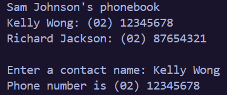

# Java Phonebook
A simple phonebook application developed in Java to practice Object-Oriented Programming (OOP).

## Features
- Store contacts using an ArrayList
- Display all contacts.
- Search for a contact by name
- Display the contact's phone number if found

## Installation
### Clone the Respository
```bash
git clone https://github.com/jiajystudio/java-phonebook.git
cd java-phonebook
```
### Run the project
```bash
javac *.java
java LookupPhonebook
```

## Technologies
- java
- Object-Oriented Programming (OOP)
- ArrayList

## Project Structure
```text
|-- Phonebook
|   |-- LookupPhonebook.java    # Main program
|   |-- Contact.java            # Contact model
|   |-- Phonebook.java          # Phonebook operation
|   |-- README.md               # Project documentation
|   |-- .gitignore              # Git igonored files
|   |-- screenshots/
|   |   |-- ...
```

## Preview
### Program Output


## Future Improvements
- Add new contacts through user input
- Delete existing contacts- Update contact information
- Sort contact alphabetically
- Save contact to a file
- Improve the user interface

## Author
Onphimol Krurjark